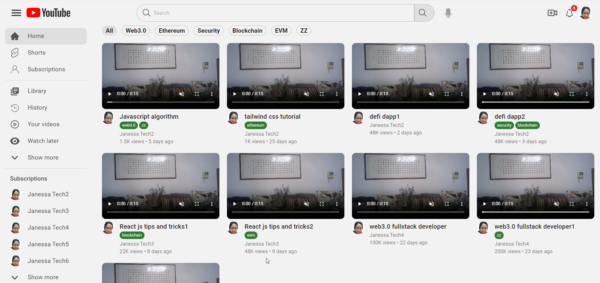
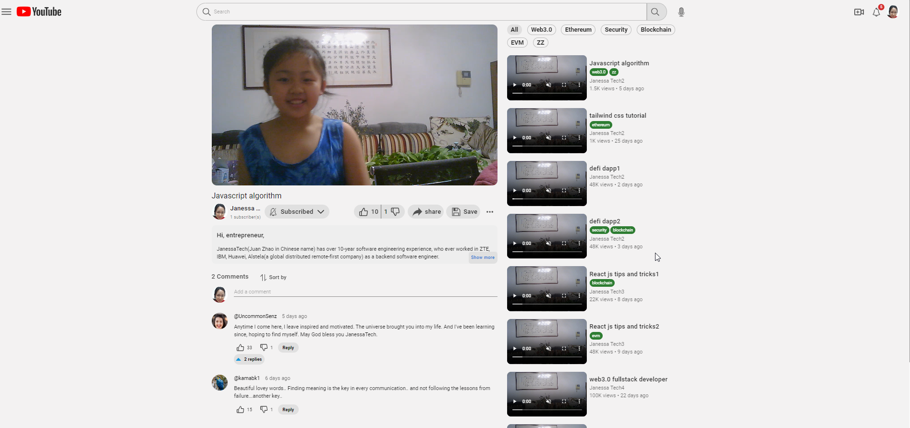

# How does the project work like?




# About this project

Check out https://www.youtube.com/watch?v=3p2KemIJi30 about how the projects

- This project is to showcase how to use material-ui library. The following features in MUI are used:
  - ThemeProvider
  - createTheme
  - styled
  - Drawer
  - Box, Container, Paper, IconButton,Button, Avatar, TextField, Typography,Tooltip
  - Collapse, breakpoints, Color,
  - Link, ListItem, Divider, Toolbar, AppBar, Tooltip, Icon
  - Card, Menu, CardMedia, Dialog, Grid
  - useMediaQuery,
  - Chip
- This project uses the following features in react:

  - useEffect, useState
  - localStorage
  - Router
  - useSearchParams
  - useNavigate

- The project is configurable
  - All data shown in the form of pages are configured in src/data/MockData.js. You could configure data here as much as you want, and the pages show you data immediately without changing any codes

# Install dependences

```
npm install @mui/material @emotion/react @emotion/styled
npm install @fontsource/roboto
npm install @mui/icons-material
npm install react-router-dom
npm install react-masonry-css
```

# How to run code

```
npm start
```
